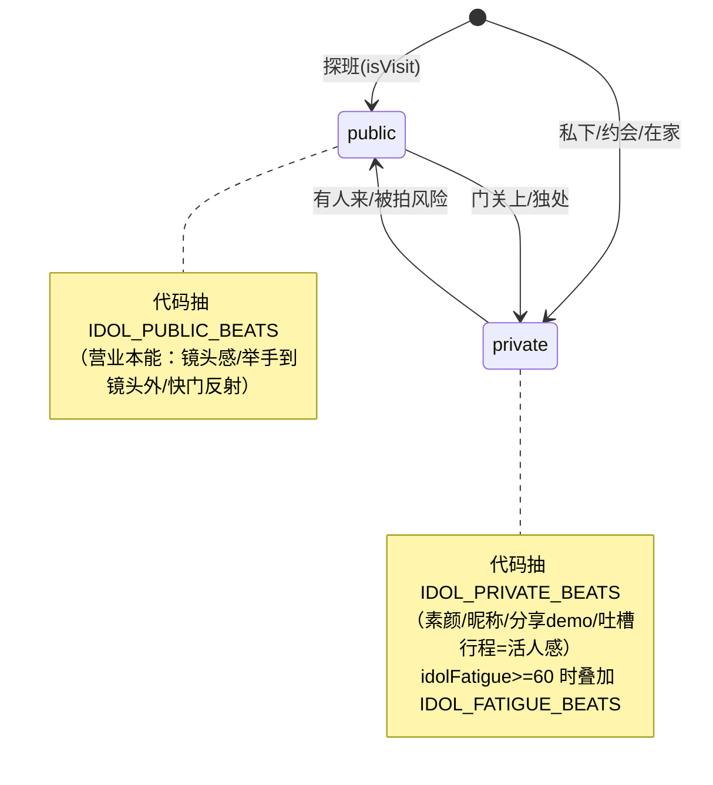
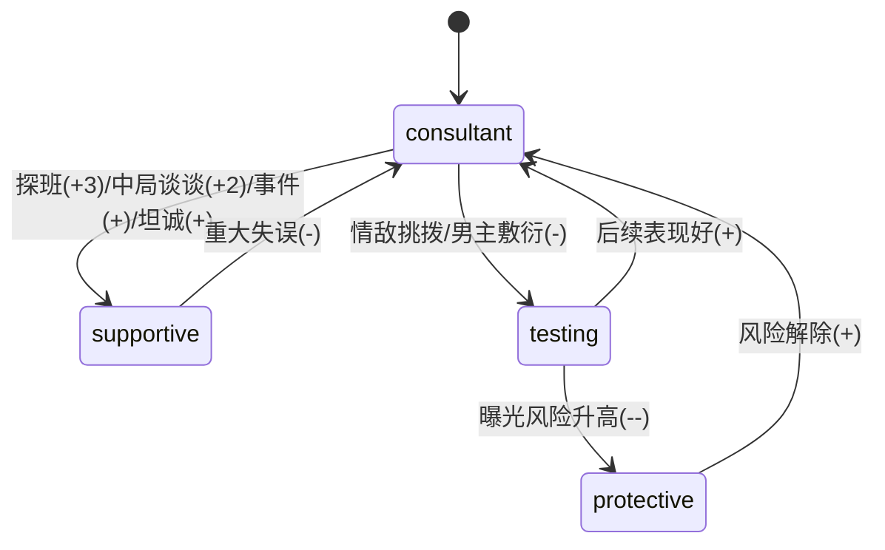

## 用户需求（更新）

用户平时只玩「娱乐圈地下恋」世界观（`src/worlds/entertainment.js`）下的**「队友的妹妹」**单一女主身份。所有改动尽量挂在分支 `GS.gameMode==='oneHeart' && GS.worldSetting==='entertainment' && GS.oneHeartRelationCharacter && GS.oneHeartRelationCharacter.role==='哥哥'` 下。

### 本轮新增方向（2026-07-08 反馈）

1. **不要全靠 AI 生成，适当用代码约束** —— "这回合发生什么、男主做出什么具体行为"由代码决定，AI 只负责把 prose 填进去。
2. **不要给 AI 那么大压力** —— 大幅裁剪现有 IMP-21（A~H 八条巨量软指令，`prompts.js:1604-1627`），改为代码注入 1~2 条**具体**行为约束。
3. **增加活人感（偶像感）** —— 男主作为偶像要有"营业 vs 私下"反差、偶像本能条件反射、疲惫失态、真实私生活细节，且由代码状态机驱动而非 AI 随缘。

## 设计原则（NEW · 代码约束优先）

- **代码定骨架，AI 填血肉**：事件抽选、行为 beat 抽选、状态推导（四态 / 疲劳 / 场合）全部在代码层确定性完成；prompt 只注入"这回合必须出现的具体 1~2 件事"，而非大段氛围描述。
- **减重 AI**：IMP-21 的 A~H 从「每段必灌 8 条」改为「代码抽 1 条具体 beat 注入」+ 末尾 2 行总原则提醒。AI 不再被要求"自行理解 8 类戏份"。
- **分支隔离**：
- 偶像行为引擎挂 `worldSetting==='entertainment'`（男主本就是 idol，对全部 13 种娱乐圈身份为**增量改进、无功能回归**）。
- 哥哥专属内容（事件池 / 四态 / HE 调优）严格挂 `role==='哥哥'`。
- transfer 模式、其他 1v1 世界观零改动。
- **[已拍板 2026-07-08] 范围决策**：用户明确"就玩娱乐圈地下恋 + 队友的妹妹这一整个系列，需要整体优化"。因此：① 偶像行为引擎**不加 `role==='哥哥'` 守卫**，直接挂 `worldSetting==='entertainment'` 对整个娱乐圈世界观生效（男主都是 idol，对全部 13 种身份是增量增强）；② 哥哥专属内容（事件池/四态/HE 调优）严格挂 `role==='哥哥'`，只针对「队友的妹妹」重点设计与测试。两者互不冲突、零回归。

## 产品概述

针对「队友的妹妹」身份，把已落地但失衡/空置/过重的 AI 软指令，重做成**代码约束 + 确定性行为**的结构：① 新增偶像行为引擎（营业/私下/疲惫三态 + 确定性 micro-beat，产出活人感/偶像感）；② 把空定义的哥哥事件池做成结构化稳定触发；③ 修复哥哥四态失衡；④ 平衡 HE 可达性；⑤ 把 IMP-21 大段软指令瘦身成代码注入。

## 核心特性

1. **[NEW·核心] 偶像行为引擎（代码约束）**：`idolFatigue`(0~100) 状态 + `idolMode`(public/private) 回合推导 + 三档 beat 池（营业本能 / 私下反差 / 疲惫失态），代码每回合抽 1~2 条**具体**行为注入 prompt，产出确定性"活人感/偶像感"。
2. **哥哥专属事件池落地（代码约束）**：`BROTHER_EVENTS`（6~8 个）填充并消费死字段 `oneHeartBrotherPool`，复用 `generateOneHeartRound` 事件分支稳定触发哥哥戏份。
3. **哥哥立场四态修复**：补负向/波动触发点（曝光升高 / 情敌挑拨 / 男主敷衍），让 testing/protective 真正可达。
4. **HE 平衡**：调整 brotherAff 获取节奏 + 必要时微调 `evaluateEnding`（:1954）阈值。
5. **Prompt 大瘦身**：裁剪 IMP-21 A~H → 代码 beat 注入 + 2 行总原则；合并精简 IMP-17 与 IMP-21 注入段。

## 技术栈

- JavaScript (ES Modules)，Node 18+，Vanilla JS + Vite（与现有项目一致）
- 无新依赖：纯前端，复用 `GS`/`setGS`/`saveGame`、事件分支机制、`buildOneHeartUserMessage` 注入函数
- 编码规范：用 `var`（不用 let/const）；字符串 `+` 拼接；AI 文本入 DOM 前经 `escHtml()`；不用 `alert`/`confirm`

## 实现方案

### 总体策略

在 IMP-17 + IMP-21 骨架上"换引擎"：**把 AI 软指令翻译成代码状态机 + 数据池**，AI 只接收"这回合必现的具体行为"。

- **偶像行为引擎（P1）**：
- `state.js` 新增 `idolFatigue`（默认 ~25，migrate 兜底）。
- `entertainment.js` 新增三档 beat 池：`IDOL_PUBLIC_BEATS`（营业本能）、`IDOL_PRIVATE_BEATS`（私下反差/活人感）、`IDOL_FATIGUE_BEATS`（疲惫失态，`idolFatigue>=60` 时启用）。
- `generateOneHeartSchedule`（:1984）消费行程时按 `cat` 推 `idolFatigue`（录音/舞蹈/综艺/拍摄/粉丝/跨界/行程 消耗型 +8~15；舞台/巡演更重）；每日推进处做疲劳恢复 `idolFatigue = max(10, idolFatigue - 12)`。
- `buildOneHeartUserMessage`（phase 分支）**代码推导** `idolMode`：`extra.isVisit`（探班）→ `public`（营业/镜头感/克制）；否则（私下/约会/在家）→ `private`（真实反差）。按 `idolMode` + `idolFatigue` 抽 1 条 beat，注入单行约束：
`[偶像此刻] 本幕让他自然做出这一处真实反应：{beat}`（代码决定，AI 只负责织入 prose）。
- **哥哥事件池（P2）**：仿 `ONE_HEART_RANDOM_EVENTS`（data.js:698）+ `pickOneHeartRandomEvent` 模式，新增 `BROTHER_EVENTS`，在 `generateOneHeartRound` 按"回合+状态+概率"抽一个，经 `oneHeartBrotherPool` 去重缓冲后注入 userMsg（同 isRandom 链路），保证哥哥戏份稳定多样。
- **四态修复（P3）**：`updateBrotherStance`（:1905，自带 `role==='哥哥'` 守卫 :1907）在曝光升高 / 情敌挑拨 / 男主敷衍等公共路径调负向 delta，使 testing/protective 可达；`prompts.js:1588-1589` 死分支随之生效。
- **HE 平衡（P4）**：在 P2/P3 提供稳定正向来源后复核 `evaluateEnding`（:1942-1957）；优先靠"增加正向获取"达标，仅在仍失衡时微调 `supportive` 阈值/HE 组合，因该判定已置 `_bs==='supportive'` 守卫，对其他身份无副作用。
- **Prompt 瘦身（P5）**：删除 `prompts.js:1604-1627` 的 A~H 八条逐条软指令，改为：① 上方 P1 的代码 beat 单行注入；② IMP-17（:1577-1601）保留但精简为"哥哥立场 + 在家状态 + 铁律"3 行；③ 末尾 2 行总原则（营业/私下反差 + 哥哥是内应非威胁）。

### 关键技术决策与权衡

- **行为 beat 由代码抽选而非 AI 自创**：把"偶像感"从"AI 是否读懂 8 条提示"变成"代码保证每回合必有 1 处真实反应"，既减重 AI 又提升活人感稳定性。
- **`idolFatigue` 持久化 + 每日恢复**：让"刚结束巡演的他累到失态"与"休整后精神抖擞"动态变化，是活人感的核心来源。
- **四态用单一数值推导保持**：仅补正负 delta 触发点，符合现有 `brotherStance` 推导（:1912），不引入新字段。
- **不新增 UI 框架**：哥哥立场指示已存在于 `ui-renderer.js:2365-2372`，仅在其上叠加 stance 变化飘字（可选增强）。

## 实现注意（防回归）

- **分支隔离**：偶像引擎挂 `worldSetting==='entertainment'`；哥哥内容挂 `role==='哥哥'`（或复用 `updateBrotherStance` 自带守卫），确保 transfer / 其他 1v1 世界观 / 其他 12 身份零误伤。
- **不破坏既有 +3/+2 调用点**：保留 `doVisitMember` 探班哥哥 +3（:2058）与中局谈谈 +2（:2123，`brotherTestNudged` 守卫），在其基础上"加"触发点，不删不改。
- **`oneHeartBrotherPool` 消费幂等**：触发后标记已用，避免同事件重复；`state.js` migrate 兜底（:545-552）若新增字段需补。
- **HE 阈值改动需回测**：模拟"正常通关 / 摆烂 / 曝光翻车"三档，确认 HE/BE/NE 与 `brotherStance` 语义一致。
- **beat 池不越界**：`IDOL_*_BEATS` 内容须为"中性可织入的具体动作"，避免与剧情强耦合导致 AI 难接；单行注入，不堆段落。
- **Prompt 合并不丢语义**：IMP-21 的 A~H 精髓（哥哥是内应、张力来自公众视线、三人与其喜剧）须以总原则 2 行 + 事件池形式保留，仅去重、不错位。

## 架构设计

### 偶像行为引擎状态机（worldSetting==='entertainment'）



### 哥哥系统状态机（role==='哥哥'）



### 数据流

`generateOneHeartSchedule` → 按 `cat` 推 `idolFatigue` → 每日推进恢复 → `generateOneHeartRound` → ① 代码抽 `BROTHER_EVENTS`（去重缓冲 `oneHeartBrotherPool`）② `buildOneHeartUserMessage` 代码推导 `idolMode` 抽 beat 注入 → AI 生成（仅填 prose）→ 按事件 `stanceDelta` 调 `updateBrotherStance`（守卫）→ `saveGame` → 结局 `evaluateEnding` 读 `brotherStance` 定档。

## 目录结构

```
src/
├── worlds/
│   └── entertainment.js     # [MODIFY] 新增 IDOL_PUBLIC_BEATS / IDOL_PRIVATE_BEATS / IDOL_FATIGUE_BEATS 三档 beat 池；新增 BROTHER_EVENTS（6-8 个）；memberDesc 对圈内人弱化为"圈内熟稔、无需伪装粉丝视角"
├── state.js                # [MODIFY] 新增 idolFatigue（migrate 兜底 :545-552）；保留 oneHeartBrotherPool 去重缓冲
├── game-engine.js          # [MODIFY] ① P1：generateOneHeartSchedule 按 cat 推 idolFatigue + 每日推进恢复；新增抽 BROTHER_EVENTS 逻辑（仿 :2110 isRandom）填充/消费 oneHeartBrotherPool ② P3：公共路径调 updateBrotherStance 负向 delta ③ P4：复核 evaluateEnding(:1942-1957)
├── prompts.js              # [MODIFY] P1：phase 分支代码推导 idolMode + 抽 beat 单行注入（替换 A~H 大段） P5：删除 :1604-1627 A~H，合并精简 IMP-17 为 3 行 + 末尾 2 行总原则
└── ui-renderer.js          # [MODIFY] 在哥哥立场指示(:2365-2372)上叠加 stance 变化轻量飘字（可选增强）
```

## 关键代码结构

```js
// src/worlds/entertainment.js —— 新增导出

// 偶像行为 beat 池（代码抽选，确定性产出"活人感/偶像感"）
export var IDOL_PUBLIC_BEATS = [
  '他听到附近疑似相机快门声，本能挺直脊背、切换营业微笑，等人走了才松懈',
  '他下意识把牵你的手举到镜头拍不到的角度',
  '工作人员走近时他立刻恢复专业疏离，回头对你偷偷吐舌'
];
export var IDOL_PRIVATE_BEATS = [
  '素颜、头发乱糟糟，毫无偶像包袱地打了个哈欠靠过来',
  '穿着你哥的超大 T 恤，局促又放松',
  '把未公开练习室视频随手分享给你，吐槽今天被舞蹈老师骂',
  '突然喊了你一个奇怪昵称，自己先笑场'
];
export var IDOL_FATIGUE_BEATS = [ // 仅 idolFatigue>=60 启用
  '练到脱力，靠在你肩上就睡着了',
  '卸了妆素颜，抱怨行程太满想罢工',
  '说着话忽然走神，嘟囔了句梦话似的台词'
];

// 哥哥专属事件池（role==='哥哥'，填充消费 oneHeartBrotherPool）
export var BROTHER_EVENTS = [
  { id: 'bro_1', name: '突击查岗', stanceDelta: -2, minRound: 6, prob: 0.22,
    desc: '哥哥临时改行程提前回家，你慌忙让男主躲进衣柜，哥哥在门外调侃"你那位还在吗"——独家喜剧，不是被抓。' },
  { id: 'bro_2', name: '家庭群翻车', stanceDelta: 1, minRound: 8, prob: 0.2,
    desc: '父母在家庭群问起你近况，哥哥替你打圆场而非拆穿，顺势试探你对男主的态度。' }
  // ... 共 6-8 条，stanceDelta 可正可负，minRound 控节奏，prob 控概率
];

// src/game-engine.js —— 偶像疲劳（generateOneHeartSchedule 内，消费行程时）
var _fatMap = { '录音': 8, '舞蹈': 10, '综艺': 9, '拍摄': 8, '粉丝': 11, '跨界': 9, '行程': 14 };
if (schedule.main && _fatMap[schedule.main.cat]) {
  GS.idolFatigue = Math.min(100, (GS.idolFatigue || 25) + _fatMap[schedule.main.cat]);
}

// src/prompts.js —— phase 分支：代码推导 idolMode 并抽 beat 单行注入（替换 A~H）
var _mode = (extra && extra.isVisit) ? 'public' : 'private';
var _pool = (_mode === 'public') ? IDOL_PUBLIC_BEATS
  : (GS.idolFatigue >= 60 ? IDOL_FATIGUE_BEATS : IDOL_PRIVATE_BEATS);
var _beat = _pool[Math.floor(Math.random() * _pool.length)];
msg += '[偶像此刻] 本幕让他自然做出这一处真实反应：' + _beat + '\n';
```